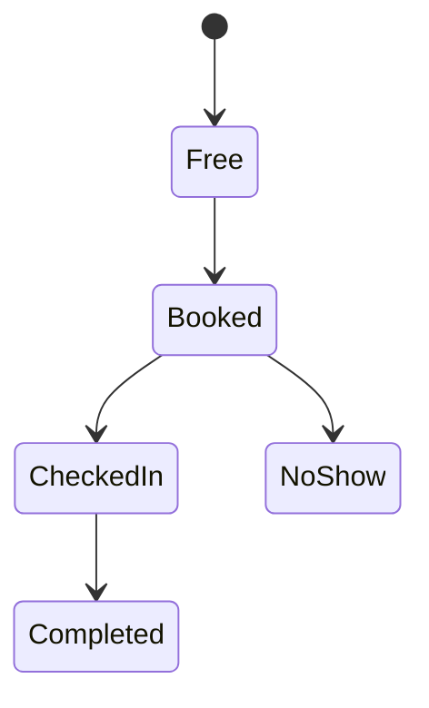

## Appointment lifecycle model

**Purpose:** show the states of an appointment from booking to the end of the visit.
**Scope:** in: booking, cancelling and the visit itself.

```mermaid
stateDiagram-v2
    [*] --> Free
    Free --> Booked
    Booked --> CheckedIn
    CheckedIn --> Completed
    Booked --> NoShow
```
