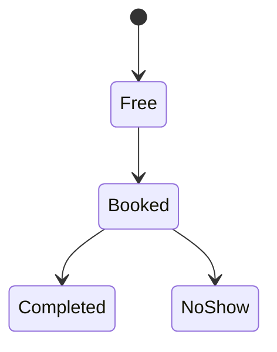

## Appointment model


```mermaid
stateDiagram-v2
    [*] --> Free
    Free --> Booked
    Booked --> Completed
    Booked --> NoShow
```

```sql
CREATE TABLE appointment (id INT PRIMARY KEY, doctor_id INT, slot_id INT, status VARCHAR(20));
CREATE INDEX idx_status ON appointment (status);
```
